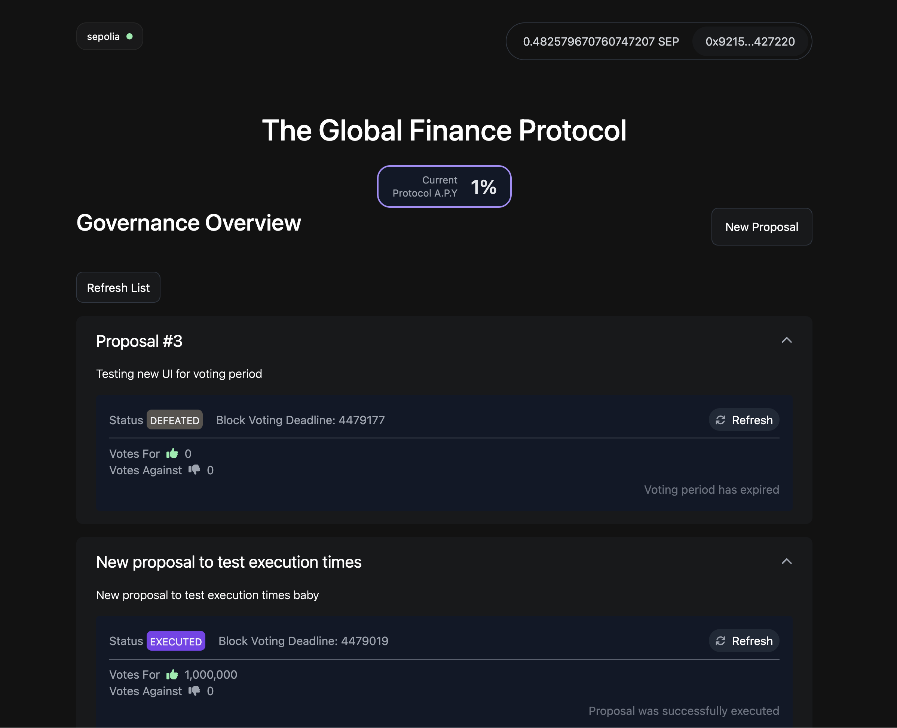

## Governance Protocol

This is a demo portfolio frontend project of a DAO / Governance Protocol. That connects to the protocol through a Node/Nest.js API to optimise communication with the blockchain.

### Features

- Proposals list: Home page shows the latest proposals
- Connect your wallet and see your account's balance.
- Create NEW proposals by clicking the **New Proposal** button.
- Vote on proposals
- Click on a proposal to view stats:
  - **Proposal status**:
    - **_Pending_**: proposal created, voting is not available (awaiting for VOTING_DELAY_PERIOD)
    - **_Active_**: users can vote
    - **_Success_**: the votes reached minimum quorum so the porposal will be queued and executed
    - **_Executed_**: proposal changes added to the governed contract
    - **_Defeated_**: proposal reached deadline without recahing the minimum quorum (QUORUM_PERCENTAGE is set to 10% in the protocol)
    - **_Canceled_**: proposal canceled by its proposer
  - **Votes amounts** measured in **voting power** (Governance Token allocation in each voter's wallet)
  - **Block Deadline**: last block to be mined before voting period finishes
  - **Voting control** buttons



## Getting Started

**IMPORTANT:** The client app connects to the blockchian through a service, so first it's necessary to set up and run the Nest.js server API `dao-protocol`

Create environment variables
Protocol is deployed in Sepolia Testnet (`'sepolia'`)

```
# .env

NEXT_PUBLIC_API_URL=<SERVER_API_URL>
NEXT_PUBLIC_NETWORK=<NETWORK_NAME>
```

Install packages:

```bash
npm install
# or
yarn
```

Run the development server:

```bash
npm run dev
# or
yarn dev
```

Optionally, `NETWORK` can be overrided at command line level

```bash
# example

NETWORK=sepolia yarn dev
```

Open [http://localhost:3000](http://localhost:3000) with your browser.
